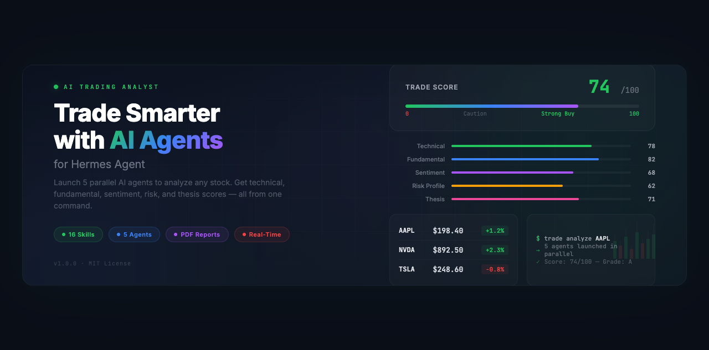

<p align="center">
  
</p>

<p align="center">
  <strong>AI-powered stock research.</strong> Run full analyses with 5 parallel subagents, build investment theses,<br/>
  assess risk, screen for opportunities, analyze options, and produce professional PDF reports — 16 skills, one command.
</p>

<p align="center">
  <a href="LICENSE"></a>
  
  
  
  
</p>

---

> **WARNING: This tool is for educational and research purposes only. It is NOT financial advice. It does NOT execute trades. It does NOT manage money. Always do your own due diligence and consult a licensed financial advisor before making investment decisions.**

---

## Quick Start

```bash
curl -fsSL https://raw.githubusercontent.com/zubair-trabzada/ai-trading-hermes/main/install.sh | bash
```

That's it. One command installs all 16 skills and the PDF generation script.

### Prerequisites

- **[Hermes Agent](https://hermes-agent.nousresearch.com)** (installed and configured)
- **Python 3.8+** (for PDF generation)
- **Internet access** (for web-based market data)

---

## What Is This?

AI Trading Analyst is a **research and analysis tool** built as Hermes Agent skills. It is **not** a trading bot. It does **not** connect to brokerages. It does **not** execute trades.

What it does: takes a ticker symbol and runs a comprehensive multi-dimensional analysis using 5 parallel AI agents — technical, fundamental, sentiment, risk, and thesis — then produces a composite Trade Score (0-100) with a clear signal (Strong Buy / Buy / Hold / Caution / Avoid).

Just say: `trade analyze AAPL` to Hermes and 5 AI agents launch in parallel to produce a complete investment research report.

No API keys. No brokerage accounts. No financial data subscriptions. Just Hermes and the web.

---

## Architecture

```
                         trade analyze <ticker>
                                 |
                   ┌─────────────┼─────────────┐
                   |             |             |
             ┌─────┴──────┐ ┌───┴─────┐ ┌─────┴──────┐
             | trade-      | | trade-  | | trade-     |
             | technical   | | funda-  | | sentiment  |
             | subagent    | | mental  | | subagent   |
             | (price,     | | subagent| | (news,     |
             |  patterns,  | | (value, | |  social,   |
             |  indicators)| |  growth)| |  analysts) |
             └─────────────┘ └────────┘ └────────────┘
                   |             |             |
             ┌─────┴──────┐ ┌───┴─────┐
             | trade-risk  | | trade-  |
             | subagent    | | thesis  |
             | (volatility,| | subagent|
             |  sizing,    | | (bull/  |
             |  drawdown)  | |  bear,  |
             |             | |  entry) |
             └─────────────┘ └────────┘
                   |             |             |
                   └─────────────┼─────────────┘
                                 |
                   ┌─────────────┴─────────────┐
                   |   Composite Trade Score    |
                   |   (0-100) + Grade + Signal |
                   |   + PDF Investment Report  |
                   └───────────────────────────┘
```

---

## All 16 Commands

Say these to Hermes Agent:

### Analysis & Research

| Command | What It Does |
|---------|-------------|
| `trade analyze <ticker>` | **Flagship** — Full stock analysis with 5 parallel subagents. Returns Trade Score (0-100), technical levels, fundamental metrics, sentiment reading, risk profile, investment thesis, and entry/exit plan. |
| `trade quick <ticker>` | 60-second stock snapshot — price, trend, key metrics, signal. No subagents. |
| `trade technical <ticker>` | Technical analysis — price action, chart patterns, indicators, support/resistance levels. |
| `trade fundamental <ticker>` | Fundamental analysis — financials, valuation metrics, competitive moat, growth trajectory. |
| `trade sentiment <ticker>` | News and social sentiment — analyst ratings, insider activity, social buzz, news tone. |
| `trade sector <sector>` | Sector rotation and momentum — relative strength, fund flows, top/bottom performers. |

### Thesis & Strategy

| Command | What It Does |
|---------|-------------|
| `trade thesis <ticker>` | Complete investment thesis — bull/bear cases, catalysts, entry/exit strategy with price levels. |
| `trade compare <t1> <t2>` | Head-to-head stock comparison across all dimensions with a winner recommendation. |
| `trade options <ticker>` | Options strategy recommendations — covered calls, spreads, protective puts based on outlook. |
| `trade earnings <ticker>` | Pre-earnings analysis — expected move, historical reactions, positioning strategy. |

### Portfolio & Risk

| Command | What It Does |
|---------|-------------|
| `trade portfolio` | Portfolio analysis — correlation matrix, sector exposure, rebalancing recommendations. |
| `trade risk <ticker>` | Risk assessment — position sizing, max drawdown, scenario analysis, risk/reward ratio. |
| `trade screen <criteria>` | Stock screener — filter by strategy (momentum, value, dividend, growth, etc.). |
| `trade watchlist` | Build and update a scored watchlist with ranked opportunities. |

### Reporting

| Command | What It Does |
|---------|-------------|
| `trade report-pdf` | Professional 6-page PDF investment report with score gauges, charts, and thesis. |

---

## Scoring Methodology

The **Trade Score** (0-100) is a weighted composite of 5 dimensions:

| Category | Weight | What It Measures |
|----------|--------|------------------|
| Technical Strength | 25% | Trend, momentum, volume, pattern quality, support/resistance |
| Fundamental Quality | 25% | Valuation, growth, profitability, balance sheet, moat |
| Sentiment & Momentum | 20% | News tone, social buzz, analyst consensus, insider signals |
| Risk Profile | 15% | Volatility, drawdown potential, correlation, liquidity |
| Thesis Conviction | 15% | Catalyst clarity, timeline, asymmetry, edge identification |

### Grade & Signal Interpretation

| Score | Grade | Signal | Meaning |
|-------|-------|--------|---------|
| 85-100 | A+ | Strong Buy | High conviction across all dimensions |
| 70-84 | A | Buy | Favorable setup with manageable risks |
| 55-69 | B | Hold | Mixed signals, wait for confirmation |
| 40-54 | C | Calcium | No clear edge, stay on sidelines |
| 25-39 | D | Caution | Significant headwinds or overvaluation |
| 0-24 | F | Avoid | Major red flags across multiple dimensions |

---

## Sample Output

### `trade analyze AAPL`

```
╔══════════════════════════════════════════════════════════════╗
║  AI TRADING ANALYSIS (Hermes)                                ║
║  AAPL — Apple Inc.                                           ║
╚══════════════════════════════════════════════════════════════╝

TRADE SCORE: 74/100 (Grade: A)  Signal: BUY

┌──────────────────────┬───────┬────────┬──────────┐
│ Category             │ Score │ Weight │ Status   │
├──────────────────────┼───────┼────────┼──────────┤
│ Technical Strength   │ 78    │ 25%    │ Strong   │
│ Fundamental Quality  │ 82    │ 25%    │ Strong   │
│ Sentiment & Momentum │ 68    │ 20%    │ Mixed    │
│ Risk Profile         │ 62    │ 15%    │ Mixed    │
│ Thesis Conviction    │ 71    │ 15%    │ Strong   │
└──────────────────────┴───────┴────────┴──────────┘

ENTRY: $178-$182  |  TARGET: $198-$205  |  STOP: $168
RISK/REWARD: 2.8:1  |  POSITION: 3-5% of portfolio

Saved: TRADE-ANALYSIS-AAPL.md
Say "trade report-pdf" to generate a professional PDF report.
```

### `trade quick NVDA`

```
============================================================
  QUICK SNAPSHOT: NVDA — NVIDIA Corp.
  <DATE> | AI Trading Analyst (Hermes)
============================================================

  Price:    $892.40  (today: +$20.40 / +2.3%)
  Mkt Cap:  $2.2T  |  P/E: 52.4  |  Sector: Technology
  52W:      $475.00 (low) — $974.00 (high)  [8% from high]
  Volume:   45.2M  (avg: 38.1M)

------------------------------------------------------------
  SIGNAL:   BUY
------------------------------------------------------------

  BULLISH FACTORS:
  + Revenue growth +122% YoY (AI demand accelerating)
  + RSI 58 — bullish zone, not overbought
  + Institutional accumulation pattern (13F inflows)

  BEARISH FACTORS:
  - P/E 52.4x — premium valuation relative to sector
  - High beta (1.7) — volatile
  - Concentration risk in AI capex cycle

  KEY LEVELS:
  Resistance: $950  |  Support: $840  |  Analyst Target: $1,050

  THESIS (one line):
  AI demand engine powering hypergrowth, but premium valuation
  requires earnings to consistently exceed lofty expectations.

------------------------------------------------------------
  Say "trade analyze NVDA" for full multi-agent analysis.
------------------------------------------------------------
  DISCLAIMER: For educational/research purposes only.
  Not financial advice. Do your own due diligence.
============================================================
```

---

## Use Cases

### Day Traders
Say `trade technical` for real-time support/resistance levels, indicator readings, and pattern recognition. Say `trade quick` for fast pre-market scans.

### Swing Traders
Say `trade analyze` for multi-dimensional analysis. Say `trade thesis` to build entry/exit plans with specific price levels and timeframes.

### Long-Term Investors
Focus on `trade fundamental` for deep valuation and moat analysis. Use `trade compare` to evaluate alternatives. Say `trade portfolio` for allocation guidance.

### Options Traders
Use `trade options` for strategy recommendations based on the current setup. Combine with `trade earnings` for pre-earnings positioning and expected move analysis.

### Portfolio Managers
Say `trade portfolio` for correlation analysis and rebalancing suggestions. Use `trade screen` to find new opportunities. Build ranked watchlists with `trade watchlist`.

---

## Project Structure

```
ai-trading-hermes/
├── trade/
│   └── SKILL.md                         # Main orchestrator (command router)
├── skills/
│   ├── trade-analyze/SKILL.md           # Full analysis launcher
│   ├── trade-technical/SKILL.md         # Technical analysis
│   ├── trade-fundamental/SKILL.md       # Fundamental analysis
│   ├── trade-sentiment/SKILL.md         # Sentiment analysis
│   ├── trade-sector/SKILL.md            # Sector rotation
│   ├── trade-compare/SKILL.md           # Stock comparison
│   ├── trade-thesis/SKILL.md            # Investment thesis
│   ├── trade-options/SKILL.md           # Options strategies
│   ├── trade-portfolio/SKILL.md         # Portfolio analysis
│   ├── trade-risk/SKILL.md              # Risk assessment
│   ├── trade-screen/SKILL.md            # Stock screener
│   ├── trade-earnings/SKILL.md          # Earnings analysis
│   ├── trade-watchlist/SKILL.md         # Watchlist builder
│   ├── trade-report-pdf/SKILL.md        # PDF report generator
│   └── trade-quick/SKILL.md             # 60-second snapshot
├── scripts/
│   └── generate_trade_pdf.py            # PDF generation (ReportLab)
├── install.sh                           # One-line installer
├── uninstall.sh                         # Clean uninstaller
├── requirements.txt                     # Python dependencies
└── README.md
```

---

## Uninstall

```bash
curl -fsSL https://raw.githubusercontent.com/zubair-trabzada/ai-trading-hermes/main/uninstall.sh | bash
```

Or run locally:
```bash
./uninstall.sh
```

---

## Disclaimer

This tool is for **educational and research purposes only**. It is **NOT financial advice**. It does **NOT** execute trades, manage portfolios, or connect to any brokerage. All analysis is based on publicly available information gathered via web search at the time of the report. Markets are inherently unpredictable. Past performance does not guarantee future results. Always do your own due diligence and consult a licensed financial advisor before making any investment decisions. The creators of this tool accept no liability for any financial losses incurred.

---

<p align="center">
  <strong>Part of the Hermes Skills Series</strong><br>
  <strong>Hermes Edition</strong>
</p>

<p align="center">
  <a href="LICENSE"></a>
</p>